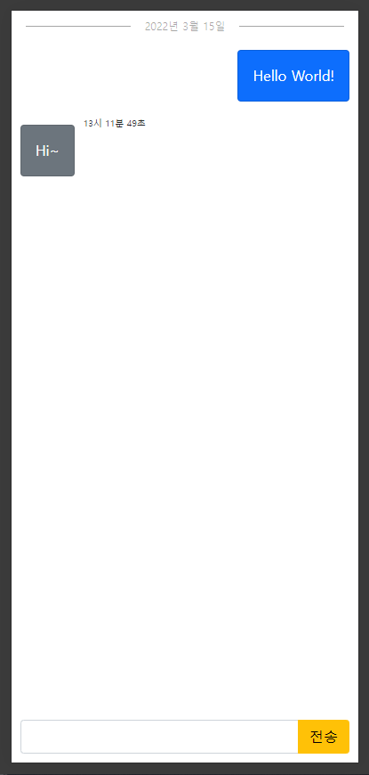

## 📕 프로젝트 개요(Introduce Project)

### Thunderbol Talk

* `Web Socket` 을 활용한 간단 채팅 프로젝트 입니다.

## 🏷️ 기능(Function)

1. [브라우저를 이용한 채팅](#브라우저를-이용한-채팅)

### 세부 기능(Function Detail)

#### 브라우저를 이용한 채팅
* Web Socket 이용하여 브라우저로 채팅합니다.

## 💻 개발 환경(Develop Environment)

### 세부 환경(Environment Detail)

* ✔ OS : 
  * 🕒 Version : `10 Pro`
* ✔ Language : 
* ✔ Dependency : 
  * [package.json](./package.json)

## 📖 비고(Remark)
